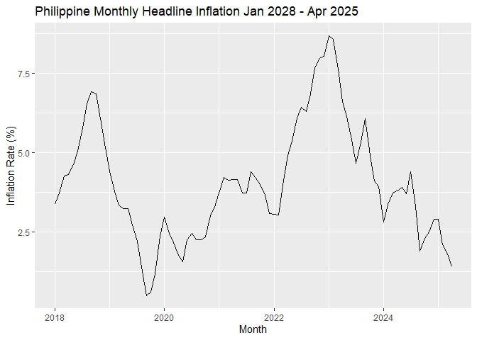
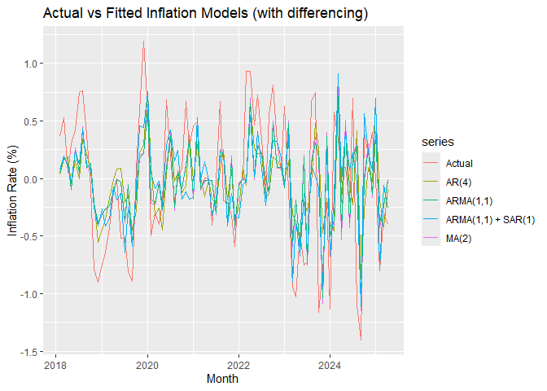
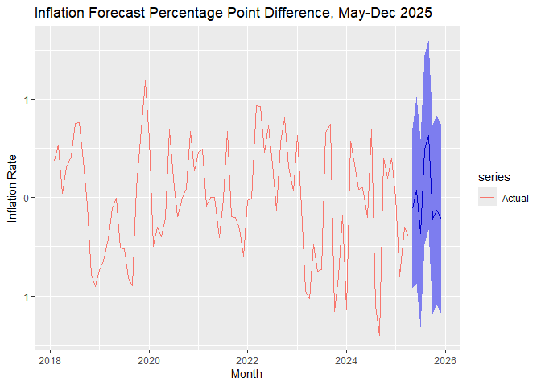
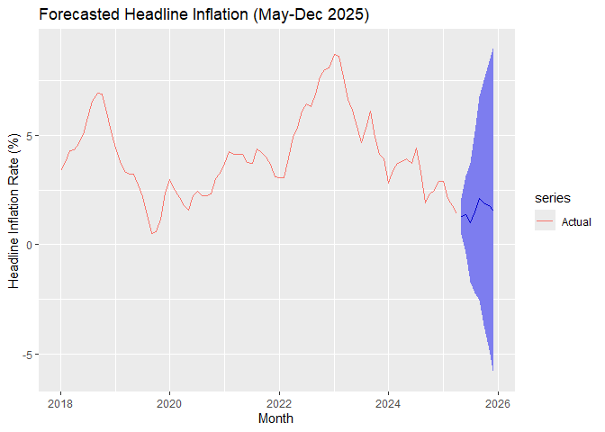

# Inflation Forecasting  

This project showcases skills in `Time Series Forecasting`, `Econometric Analysis`, `ARIMA Modeling`, `Tidyverse`, and `ggplot2`.  

The goal is to forecast **Philippine Inflation for 2025** using ARIMA models while validating results through diagnostic tests.

---

## Project: Forecasting 2025 PH Inflation  
- The dataset (`inf_ph.csv`) contains monthly inflation rates from **2018 to 2025**.
- The goal is to analyze **inflation trends**, test for stationarity, and build **predictive models**.
- Various **ARIMA-based models** are tested, including **AutoARIMA, AR(4), MA(2), and ARMA(1,1)+SAR(1)**.
- Codes are in `inflation.Rmd`. If you are viewing on `Github`, click on `inflation.md`.

### Inflation Trends & Stationarity Tests  
Before modeling, inflation data is explored through **visualization and stationarity checks**.

**Philippine Monthly Headline Inflation (Jan 2018 - Apr 2025)**  
<!-- -->

- Inflation exhibits **cyclical behavior** approximately every **2-3 years**, suggesting policy-driven corrections.  
- A **first-difference transformation** was applied to ensure stationarity.  

---

### Model Selection & Testing  
Several ARIMA models were tested based on **AIC/BIC criteria** and residual diagnostics.

#### **Model Comparisons**  
- `AR(4)`: Captures autoregressive inflation behavior.
- `MA(2)`: Focuses on moving average components.
- `ARMA(1,1)`: Balances autoregressive and moving average effects.
- `ARMA(1,1) + SAR(1)`: Includes seasonal autoregressive components, **chosen as best model**.

**Actual vs Fitted Inflation Models (with differencing)**  
<!-- -->

From `AIC/BIC`, **ARMA(1,1) + SAR(1) provided the best fit**, balancing residual white noise, normality, and homoskedasticity.

---

### Forecasting Inflation for 2025  
Using the best-fitting model, monthly inflation forecasts for **May-Dec 2025** were generated.

**Inflation Forecast Percentage Point Difference (May-Dec 2025)**  
<!-- -->

### Headline Inflation Forecast  
To transform forecasted **first differences** into **headline inflation**, cumulative summation was applied.

**Forecasted Headline Inflation (May-Dec 2025)**  
<!-- -->

**Table of Forecasts for 2025**

**AS OF JUNE 3, BSP HAS UPDATED THEIR INTERVAL FOR MAY 2025 INFLATION AND IT IS RIGHT IN OUR INTERVAL [0.9, 1.7]**
### Key findings:
- **May 2025 forecast interval:** `[0.4760%, 2.1029%]`
- **Average forecasted inflation for the rest of 2025:** **`1.56%` (below BSP target)**
---

🚀 Full details in **[inflation.md](inflation.md)**
