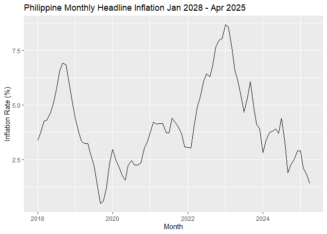

Inflation 2025 Forecasting
================
Car3lo
2025-05-18

# Forecasting 2025 PH Inflation Rates

### Load Libraries and Dataset

``` r
library(tidyverse)
```

    ## Warning: package 'ggplot2' was built under R version 4.3.3

    ## ── Attaching core tidyverse packages ──────────────────────── tidyverse 2.0.0 ──
    ## ✔ dplyr     1.1.3     ✔ readr     2.1.4
    ## ✔ forcats   1.0.0     ✔ stringr   1.5.1
    ## ✔ ggplot2   3.5.1     ✔ tibble    3.2.1
    ## ✔ lubridate 1.9.3     ✔ tidyr     1.3.0
    ## ✔ purrr     1.0.2     
    ## ── Conflicts ────────────────────────────────────────── tidyverse_conflicts() ──
    ## ✖ dplyr::filter() masks stats::filter()
    ## ✖ dplyr::lag()    masks stats::lag()
    ## ℹ Use the conflicted package (<http://conflicted.r-lib.org/>) to force all conflicts to become errors

``` r
library(forecast)
```

    ## Warning: package 'forecast' was built under R version 4.3.3

    ## Registered S3 method overwritten by 'quantmod':
    ##   method            from
    ##   as.zoo.data.frame zoo

``` r
library(fpp2)
```

    ## Warning: package 'fpp2' was built under R version 4.3.3

    ## ── Attaching packages ────────────────────────────────────────────── fpp2 2.5 ──
    ## ✔ fma       2.5     ✔ expsmooth 2.3

    ## Warning: package 'fma' was built under R version 4.3.3

    ## Warning: package 'expsmooth' was built under R version 4.3.3

    ## 

``` r
library(aTSA)
```

    ## 
    ## Attaching package: 'aTSA'
    ## 
    ## The following object is masked from 'package:forecast':
    ## 
    ##     forecast
    ## 
    ## The following object is masked from 'package:graphics':
    ## 
    ##     identify

``` r
library(FinTS)
```

    ## Warning: package 'FinTS' was built under R version 4.3.3

    ## Loading required package: zoo

    ## Warning: package 'zoo' was built under R version 4.3.3

    ## 
    ## Attaching package: 'zoo'
    ## 
    ## The following objects are masked from 'package:base':
    ## 
    ##     as.Date, as.Date.numeric
    ## 
    ## 
    ## Attaching package: 'FinTS'
    ## 
    ## The following object is masked from 'package:fma':
    ## 
    ##     ibm
    ## 
    ## The following object is masked from 'package:forecast':
    ## 
    ##     Acf

``` r
library(lmtest)
```

    ## Warning: package 'lmtest' was built under R version 4.3.3

``` r
setwd("D:/New Documents/UPSE_4-2/portfolio_temp/[132] Remittance and Inflation Forecasts/Inflation")
```

### Creating Objects

``` r
inf <- read.csv("inf_ph.csv")
inf_ph <- ts(inf[,2], frequency = 12, start = c(2018,1), end = c(2025,4))
inf_ph
```

    ##            Jan       Feb       Mar       Apr       May       Jun       Jul
    ## 2018 3.3686310 3.7368564 4.2666667 4.3135914 4.6189189 5.0416216 5.7917192
    ## 2019 4.4238683 3.7793667 3.3536585 3.2388664 3.2323232 2.7162978 2.1956088
    ## 2020 2.9556650 2.4606299 2.1632252 1.7647059 1.5655577 2.2526934 2.4414062
    ## 2021 3.7320574 4.2267051 4.1385948 4.1425819 4.1425819 3.7356322 3.7178265
    ## 2022 3.0442804 3.0414747 3.9741220 4.9028677 5.3654024 6.0941828 6.4338235
    ## 2023 8.6839749 8.5867621 7.6444444 6.6137566 6.1457419 5.3959965 4.6632124
    ## 2024 2.8006590 3.3772652 3.7159372 3.8000000 3.9000000 3.7000000 4.4000000
    ## 2025 2.9000000 2.1000000 1.8000000 1.4000000                              
    ##            Aug       Sep       Oct       Nov       Dec
    ## 2018 6.5501348 6.9315179 6.8547640 6.0691489 5.1655172
    ## 2019 1.3847676 0.4897160 0.5865103 1.1764706 2.3668639
    ## 2020 2.2439024 2.2417154 2.3323615 3.0038760 3.2755299
    ## 2021 4.3893130 4.1944709 3.9886040 3.6688617 3.0783582
    ## 2022 6.3071298 6.8618481 7.6712329 7.9854809 8.0542986
    ## 2023 5.3310404 6.0787671 4.9194232 4.1176471 3.9363484
    ## 2024 3.3000000 1.9000000 2.3000000 2.5000000 2.9000000
    ## 2025

### Plottingg

``` r
autoplot(inf_ph)+
  xlab("Month")+
  ylab("Inflation Rate (%)")+
  ggtitle("Philippine Monthly Headline Inflation Jan 2028 - Apr 2025")
```

<!-- -->

- Inflation had uptrend-peak-downtrend patterns within 2-3 years.
- This suggests cyclic behavior from it.
- There may also be a hint of weak seasonality.
- They also peak and bottom near 7.5% and 2.5% respectively implying
  corrective policy changes

### Checking for Stationarity

``` r
ggtsdisplay(inf_ph)
```

<!-- -->

``` r
# Augmented Dickey-Fuller (ADF) test
floor(12*(length(inf_ph)/100)^(1/4))+1 
```

    ## [1] 12

``` r
adf.test(inf_ph, nlag=12) 
```

    ## Augmented Dickey-Fuller Test 
    ## alternative: stationary 
    ##  
    ## Type 1: no drift no trend 
    ##       lag    ADF p.value
    ##  [1,]   0 -0.796  0.3928
    ##  [2,]   1 -1.156  0.2632
    ##  [3,]   2 -1.093  0.2858
    ##  [4,]   3 -1.133  0.2716
    ##  [5,]   4 -0.992  0.3223
    ##  [6,]   5 -1.181  0.2541
    ##  [7,]   6 -1.318  0.2050
    ##  [8,]   7 -1.737  0.0813
    ##  [9,]   8 -1.469  0.1506
    ## [10,]   9 -1.280  0.2186
    ## [11,]  10 -1.168  0.2588
    ## [12,]  11 -0.891  0.3585
    ## Type 2: with drift no trend 
    ##       lag   ADF p.value
    ##  [1,]   0 -1.13  0.6503
    ##  [2,]   1 -2.12  0.2824
    ##  [3,]   2 -1.78  0.4138
    ##  [4,]   3 -2.01  0.3255
    ##  [5,]   4 -1.39  0.5575
    ##  [6,]   5 -1.89  0.3697
    ##  [7,]   6 -1.83  0.3932
    ##  [8,]   7 -3.04  0.0383
    ##  [9,]   8 -2.38  0.1840
    ## [10,]   9 -2.23  0.2409
    ## [11,]  10 -2.30  0.2145
    ## [12,]  11 -1.72  0.4358
    ## Type 3: with drift and trend 
    ##       lag   ADF p.value
    ##  [1,]   0 -1.02  0.9298
    ##  [2,]   1 -2.05  0.5487
    ##  [3,]   2 -1.71  0.6920
    ##  [4,]   3 -1.93  0.5991
    ##  [5,]   4 -1.30  0.8635
    ##  [6,]   5 -1.84  0.6360
    ##  [7,]   6 -1.83  0.6393
    ##  [8,]   7 -3.23  0.0881
    ##  [9,]   8 -2.60  0.3242
    ## [10,]   9 -2.43  0.3927
    ## [11,]  10 -2.51  0.3611
    ## [12,]  11 -1.78  0.6626
    ## ---- 
    ## Note: in fact, p.value = 0.01 means p.value <= 0.01

- We will use Type 3 since from the autoplot, the inflation series has
  cyclic behavior

- HO: Series has unit-root; non-stationary

- HA: Series is stationary

- Decision: We reject HO if all p-values of lags up to 12 in the ADF
  test’s selected Type is \< 0.05

- Conclusion: All p-values are above 0.05, so we do not reject HO. The
  inflation series is non-stationary.

### First-Difference Transformation and Checking for Stationarity

``` r
dinf_ph <- diff(inf_ph,1)
autoplot(dinf_ph)
```

<!-- -->

``` r
adf.test(dinf_ph, nlag=12) 
```

    ## Augmented Dickey-Fuller Test 
    ## alternative: stationary 
    ##  
    ## Type 1: no drift no trend 
    ##       lag   ADF p.value
    ##  [1,]   0 -5.73  0.0100
    ##  [2,]   1 -5.63  0.0100
    ##  [3,]   2 -4.26  0.0100
    ##  [4,]   3 -5.16  0.0100
    ##  [5,]   4 -3.57  0.0100
    ##  [6,]   5 -3.63  0.0100
    ##  [7,]   6 -2.48  0.0150
    ##  [8,]   7 -3.15  0.0100
    ##  [9,]   8 -2.93  0.0100
    ## [10,]   9 -2.58  0.0109
    ## [11,]  10 -3.06  0.0100
    ## [12,]  11 -4.27  0.0100
    ## Type 2: with drift no trend 
    ##       lag   ADF p.value
    ##  [1,]   0 -5.70  0.0100
    ##  [2,]   1 -5.62  0.0100
    ##  [3,]   2 -4.25  0.0100
    ##  [4,]   3 -5.15  0.0100
    ##  [5,]   4 -3.57  0.0100
    ##  [6,]   5 -3.66  0.0100
    ##  [7,]   6 -2.54  0.1212
    ##  [8,]   7 -3.20  0.0245
    ##  [9,]   8 -2.97  0.0445
    ## [10,]   9 -2.61  0.0976
    ## [11,]  10 -3.07  0.0358
    ## [12,]  11 -4.24  0.0100
    ## Type 3: with drift and trend 
    ##       lag   ADF p.value
    ##  [1,]   0 -5.71  0.0100
    ##  [2,]   1 -5.62  0.0100
    ##  [3,]   2 -4.27  0.0100
    ##  [4,]   3 -5.17  0.0100
    ##  [5,]   4 -3.57  0.0404
    ##  [6,]   5 -3.63  0.0358
    ##  [7,]   6 -2.48  0.3747
    ##  [8,]   7 -3.14  0.1075
    ##  [9,]   8 -2.94  0.1894
    ## [10,]   9 -2.59  0.3307
    ## [11,]  10 -3.05  0.1429
    ## [12,]  11 -4.25  0.0100
    ## ---- 
    ## Note: in fact, p.value = 0.01 means p.value <= 0.01

- We will use Type 1 since from the autoplot, the inflation series seem
  to have no trend/drift

- HO: Series has unit-root; non-stationary

- HA: Series is stationary

- Conclusion: All p-values are below 0.05 (around 0.01) – we reject Ho.
  It is now stationary.

### ARIMA MODELLING AND RESIDUAL DIAGNOSTICS

``` r
inf_ph_auto <- auto.arima(inf_ph)
checkresiduals(inf_ph_auto)
```

<!-- -->

    ## 
    ##  Ljung-Box test
    ## 
    ## data:  Residuals from ARIMA(3,0,1)(2,0,0)[12] with non-zero mean
    ## Q* = 20.5, df = 12, p-value = 0.0582
    ## 
    ## Model df: 6.   Total lags used: 18

``` r
Box.test(residuals(inf_ph_auto), type="Ljung-Box")
```

    ## 
    ##  Box-Ljung test
    ## 
    ## data:  residuals(inf_ph_auto)
    ## X-squared = 0.013947, df = 1, p-value = 0.906

``` r
shapiro.test(residuals(inf_ph_auto))
```

    ## 
    ##  Shapiro-Wilk normality test
    ## 
    ## data:  residuals(inf_ph_auto)
    ## W = 0.98983, p-value = 0.7322

``` r
ArchTest(residuals(inf_ph_auto))
```

    ## 
    ##  ARCH LM-test; Null hypothesis: no ARCH effects
    ## 
    ## data:  residuals(inf_ph_auto)
    ## Chi-squared = 10.546, df = 12, p-value = 0.5681

- We fail to reject the Null Hypothesis that the residuals are white
  noise. This is consistent with the ACF graph.
- We fail to reject the Null Hypothesis that the residuals are normally
  distributed. This is consistent with the histogram of its residuals.
- We fail to reject the Null Hypothesis that the residuals are
  homoskedastic.

### The Model

- Model suggests ARIMA(3,0,1)(2,0,0)\[12\] with non-zero mean model.

- ARIMA(3,0,1) non-seasonal part:

- - 3 AR Terms (current value depends on past 3 observations)

- - 0 differencing

- - 1 MA terms (accounts for single lagged error term)

- ARIMA (2,0,0)\[12\] seasonal part:

- - 2 Seasonal AR Terms (12 months ago with two-lag effect)

- - 0 seasonal differencing

- - 0 seasonal MA terms

- - \[12\] period of seasonal pattern

- Non-zero includes constant or trend component.

#### Testing the model further

``` r
autoplot(inf_ph_auto)
```

<!-- -->

``` r
coeftest(inf_ph_auto)
```

    ## 
    ## z test of coefficients:
    ## 
    ##            Estimate Std. Error z value  Pr(>|z|)    
    ## ar1        0.690738   0.117080  5.8997 3.641e-09 ***
    ## ar2        0.431771   0.156682  2.7557  0.005857 ** 
    ## ar3       -0.189556   0.114358 -1.6576  0.097405 .  
    ## ma1        0.905706   0.052059 17.3978 < 2.2e-16 ***
    ## sar1      -0.595268   0.114807 -5.1850 2.161e-07 ***
    ## sar2      -0.264925   0.128312 -2.0647  0.038952 *  
    ## intercept  3.843356   0.596198  6.4464 1.145e-10 ***
    ## ---
    ## Signif. codes:  0 '***' 0.001 '**' 0.01 '*' 0.05 '.' 0.1 ' ' 1

- From the z test of coefficients, all are significant (not less than 0)
  at at least 5% significance level
- EXCEPT for AR3 – the third lag of AR terms do not contribute
  significantly to the model

### Plotting Fitted vs Actual

``` r
inf_ph_auto_fit <- fitted(inf_ph_auto)
autoplot(inf_ph, series="Actual") +
  autolayer(inf_ph_auto_fit, series="Fitted") +
  ggtitle("Actual vs Fitted Inflation") +
  xlab("Month") + ylab("Inflation Rate (%)")
```

<!-- -->

### Trying simpler models

``` r
# AR(4)
inf_ph_AR4 <- arima(dinf_ph, order = c(4,0,0))

Box.test(residuals(inf_ph_AR4), type = "Ljung-Box")
```

    ## 
    ##  Box-Ljung test
    ## 
    ## data:  residuals(inf_ph_AR4)
    ## X-squared = 0.38606, df = 1, p-value = 0.5344

``` r
shapiro.test(residuals(inf_ph_AR4))
```

    ## 
    ##  Shapiro-Wilk normality test
    ## 
    ## data:  residuals(inf_ph_AR4)
    ## W = 0.97963, p-value = 0.1866

``` r
ArchTest(residuals(inf_ph_AR4))
```

    ## 
    ##  ARCH LM-test; Null hypothesis: no ARCH effects
    ## 
    ## data:  residuals(inf_ph_AR4)
    ## Chi-squared = 24.258, df = 12, p-value = 0.01876

``` r
autoplot(inf_ph_AR4)
```

<!-- -->

``` r
coeftest(inf_ph_AR4)
```

    ## 
    ## z test of coefficients:
    ## 
    ##            Estimate Std. Error z value  Pr(>|z|)    
    ## ar1        0.544154   0.102348  5.3167 1.057e-07 ***
    ## ar2       -0.252829   0.115891 -2.1816  0.029139 *  
    ## ar3        0.236296   0.116010  2.0369  0.041665 *  
    ## ar4       -0.283179   0.102637 -2.7590  0.005797 ** 
    ## intercept -0.024863   0.069649 -0.3570  0.721111    
    ## ---
    ## Signif. codes:  0 '***' 0.001 '**' 0.01 '*' 0.05 '.' 0.1 ' ' 1

``` r
# MA(2)
inf_ph_MA2 <- arima(dinf_ph, order = c(0, 0, 2))

Box.test(residuals(inf_ph_MA2), type = "Ljung-Box")
```

    ## 
    ##  Box-Ljung test
    ## 
    ## data:  residuals(inf_ph_MA2)
    ## X-squared = 0.025895, df = 1, p-value = 0.8722

``` r
shapiro.test(residuals(inf_ph_MA2))
```

    ## 
    ##  Shapiro-Wilk normality test
    ## 
    ## data:  residuals(inf_ph_MA2)
    ## W = 0.98336, p-value = 0.3285

``` r
ArchTest(residuals(inf_ph_MA2))
```

    ## 
    ##  ARCH LM-test; Null hypothesis: no ARCH effects
    ## 
    ## data:  residuals(inf_ph_MA2)
    ## Chi-squared = 20.395, df = 12, p-value = 0.05997

``` r
autoplot(inf_ph_MA2)
```

<!-- -->

``` r
coeftest(inf_ph_MA2)
```

    ## 
    ## z test of coefficients:
    ## 
    ##            Estimate Std. Error z value  Pr(>|z|)    
    ## ma1        0.744086   0.095742  7.7718 7.741e-15 ***
    ## ma2       -0.161424   0.092340 -1.7481   0.08044 .  
    ## intercept -0.026673   0.079308 -0.3363   0.73663    
    ## ---
    ## Signif. codes:  0 '***' 0.001 '**' 0.01 '*' 0.05 '.' 0.1 ' ' 1

``` r
# ARMA(1,1)
inf_ph_ARMA11 <- arima(dinf_ph, order = c(1,0,1))

Box.test(residuals(inf_ph_ARMA11), type = "Ljung-Box")
```

    ## 
    ##  Box-Ljung test
    ## 
    ## data:  residuals(inf_ph_ARMA11)
    ## X-squared = 0.072797, df = 1, p-value = 0.7873

``` r
shapiro.test(residuals(inf_ph_ARMA11))
```

    ## 
    ##  Shapiro-Wilk normality test
    ## 
    ## data:  residuals(inf_ph_ARMA11)
    ## W = 0.98084, p-value = 0.2249

``` r
ArchTest(residuals(inf_ph_ARMA11))
```

    ## 
    ##  ARCH LM-test; Null hypothesis: no ARCH effects
    ## 
    ## data:  residuals(inf_ph_ARMA11)
    ## Chi-squared = 19.105, df = 12, p-value = 0.08602

``` r
autoplot(inf_ph_ARMA11)
```

<!-- -->

``` r
coeftest(inf_ph_ARMA11)
```

    ## 
    ## z test of coefficients:
    ## 
    ##            Estimate Std. Error z value Pr(>|z|)    
    ## ar1       -0.228363   0.114211 -1.9995  0.04556 *  
    ## ma1        0.931205   0.042737 21.7892  < 2e-16 ***
    ## intercept -0.026322   0.078370 -0.3359  0.73697    
    ## ---
    ## Signif. codes:  0 '***' 0.001 '**' 0.01 '*' 0.05 '.' 0.1 ' ' 1

### Trying ARMA(1,1)+SAR(1)

``` r
inf_ph_ARMA11_SAR1 <- arima(dinf_ph, order = c(1, 0, 1), seasonal = list(order = c(1, 0, 0), period = 12))
```

    ## Warning in log(s2): NaNs produced

``` r
Box.test(residuals(inf_ph_ARMA11_SAR1), type = "Ljung-Box")
```

    ## 
    ##  Box-Ljung test
    ## 
    ## data:  residuals(inf_ph_ARMA11_SAR1)
    ## X-squared = 0.26177, df = 1, p-value = 0.6089

``` r
shapiro.test(residuals(inf_ph_ARMA11_SAR1)) 
```

    ## 
    ##  Shapiro-Wilk normality test
    ## 
    ## data:  residuals(inf_ph_ARMA11_SAR1)
    ## W = 0.99177, p-value = 0.8657

``` r
ArchTest(residuals(inf_ph_ARMA11_SAR1))
```

    ## 
    ##  ARCH LM-test; Null hypothesis: no ARCH effects
    ## 
    ## data:  residuals(inf_ph_ARMA11_SAR1)
    ## Chi-squared = 8.8244, df = 12, p-value = 0.7179

``` r
autoplot(inf_ph_ARMA11_SAR1)
```

<!-- -->

``` r
coeftest(inf_ph_ARMA11_SAR1)
```

    ## 
    ## z test of coefficients:
    ## 
    ##            Estimate Std. Error z value Pr(>|z|)    
    ## ar1       -0.299668   0.119642 -2.5047  0.01226 *  
    ## ma1        0.897496   0.052951 16.9497  < 2e-16 ***
    ## sar1      -0.473895   0.101308 -4.6777  2.9e-06 ***
    ## intercept -0.020957   0.046038 -0.4552  0.64896    
    ## ---
    ## Signif. codes:  0 '***' 0.001 '**' 0.01 '*' 0.05 '.' 0.1 ' ' 1

#### \*\*FOR ARMA(1,1)+SAR(1)

- At 5% Significance we fail to reject HO (The residuals are white
  noise)
- At 5% Significance we fail to reject HO (The residuals are normally
  distributed)
- At 5% significance we fail to reject HO (The residuals are
  homoskedastic)
- All inverse AR and MA roots are within their unit circles.
- AR(1), MA(1), and SAR(1) are all significant at atleast 5%
  significance level.
- Past values, short-term shocks, and last year’s inflation affect
  current inflation in the series.

### Other Models and their Coefficients

<figure>

<figcaption aria-hidden="true">Table of Equations</figcaption>
</figure>

### Plotting the Models

``` r
autoplot(dinf_ph, series = "Actual") +
  autolayer(fitted(inf_ph_AR4), series = "AR(4)") +
  autolayer(fitted(inf_ph_MA2), series = "MA(2)") +
  autolayer(fitted(inf_ph_ARMA11), series = "ARMA(1,1)") +
  autolayer(fitted(inf_ph_ARMA11_SAR1), series = "ARMA(1,1) + SAR(1)") +
  xlab("Month") + 
  ylab("Inflation Rate (%)") +
  ggtitle("Actual vs Fitted Inflation Models (with differencing)")
```

<!-- --> - All
models seem close to fitting actual differenced inflation values. - The
closest one seems to be ARMA(1,1) + SAR(1) Model

### Comparing Accuracy

``` r
# RMSE MAE MAPE
accuracy(inf_ph_auto)
```

    ##                       ME      RMSE       MAE      MPE     MAPE      MASE
    ## Training set 0.005439472 0.3901899 0.3085799 -1.75827 9.731978 0.1396679
    ##                     ACF1
    ## Training set -0.01237773

``` r
accuracy(inf_ph_AR4)
```

    ##                       ME      RMSE       MAE MPE MAPE      MASE       ACF1
    ## Training set 0.001490521 0.4878902 0.3874257 NaN  Inf 0.8659444 0.06548179

``` r
accuracy(inf_ph_MA2)
```

    ##                        ME      RMSE      MAE MPE MAPE      MASE        ACF1
    ## Training set 0.0007732352 0.4688039 0.367736 NaN  Inf 0.8219354 -0.01695894

``` r
accuracy(inf_ph_ARMA11)
```

    ##                        ME      RMSE       MAE MPE MAPE      MASE       ACF1
    ## Training set 0.0005662236 0.4665009 0.3655609 NaN  Inf 0.8170738 0.02843478

``` r
accuracy(inf_ph_ARMA11_SAR1)
```

    ##                       ME      RMSE       MAE MPE MAPE      MASE       ACF1
    ## Training set 0.004353171 0.4150175 0.3371233 NaN  Inf 0.7535122 0.05392027

``` r
# AIC, AICc, BIC
AIC(inf_ph_auto)
```

    ## [1] 108.788

``` r
BIC(inf_ph_auto)
```

    ## [1] 128.6067

``` r
inf_ph_auto$aicc
```

    ## [1] 110.6108

``` r
Arima(dinf_ph, order = c(4, 0, 0), include.mean = TRUE)
```

    ## Series: dinf_ph 
    ## ARIMA(4,0,0) with non-zero mean 
    ## 
    ## Coefficients:
    ##          ar1      ar2     ar3      ar4     mean
    ##       0.5442  -0.2528  0.2363  -0.2832  -0.0249
    ## s.e.  0.1023   0.1159  0.1160   0.1026   0.0696
    ## 
    ## sigma^2 = 0.2526:  log likelihood = -61.32
    ## AIC=134.64   AICc=135.69   BIC=149.44

``` r
Arima(dinf_ph, order = c(0, 0, 2), include.mean = TRUE)
```

    ## Series: dinf_ph 
    ## ARIMA(0,0,2) with non-zero mean 
    ## 
    ## Coefficients:
    ##          ma1      ma2     mean
    ##       0.7441  -0.1614  -0.0267
    ## s.e.  0.0957   0.0923   0.0793
    ## 
    ## sigma^2 = 0.2276:  log likelihood = -58.34
    ## AIC=124.68   AICc=125.17   BIC=134.54

``` r
Arima(dinf_ph, order = c(1, 0, 1), include.mean = TRUE)
```

    ## Series: dinf_ph 
    ## ARIMA(1,0,1) with non-zero mean 
    ## 
    ## Coefficients:
    ##           ar1     ma1     mean
    ##       -0.2284  0.9312  -0.0263
    ## s.e.   0.1142  0.0427   0.0784
    ## 
    ## sigma^2 = 0.2254:  log likelihood = -57.91
    ## AIC=123.81   AICc=124.3   BIC=133.68

``` r
Arima(dinf_ph, order = c(1, 0, 1), seasonal = c(1, 0, 0), include.mean = TRUE)
```

    ## Series: dinf_ph 
    ## ARIMA(1,0,1)(1,0,0)[12] with non-zero mean 
    ## 
    ## Coefficients:
    ##           ar1     ma1     sar1    mean
    ##       -0.2997  0.8975  -0.4739  -0.021
    ## s.e.   0.1196  0.0530   0.1013   0.046
    ## 
    ## sigma^2 = 0.1805:  log likelihood = -49.14
    ## AIC=108.27   AICc=109.01   BIC=120.6

- Although lowest RMSE and MAE belong to autoarima, ARMA(1,1)+SAR(1) has
  lowest AIC, AICc, BIC.
- Plus, the RMSE and MAE are pretty close anyway.
- So we will choose ARMA(1,1)+SAR(1) as our “best fitting” model.

<figure>

<figcaption aria-hidden="true">Accuracy</figcaption>
</figure>

### Forecasting and Plotting First Difference

``` r
inf_ph_ARMA11_SAR1_forecast <- forecast::forecast(inf_ph_ARMA11_SAR1, h = 8, level = 95) #conflicts with aTSA
autoplot(inf_ph_ARMA11_SAR1_forecast) +
  autolayer(dinf_ph, series = "Actual") +
  xlab("Month")+
  ylab("Inflation Rate")+
  ggtitle("Inflation Forecast Percentage Point Difference, May-Dec 2025")
```

<!-- -->

### Plotting Headline Inflation

``` r
# get first differences from object
diff_forecast <- inf_ph_ARMA11_SAR1_forecast$mean
diff_lower <- inf_ph_ARMA11_SAR1_forecast$lower[,1]
diff_upper <- inf_ph_ARMA11_SAR1_forecast$upper[,1]

# convert to headline inflation with april 2025 value (1.4)
headline_forecast <- 1.4 + cumsum(diff_forecast)
headline_lower <- 1.4 + cumsum(diff_lower)
headline_upper <- 1.4 + cumsum(diff_upper)

# make it timeseries
ts_forecast <- ts(headline_forecast, start = c(2025, 5), frequency = 12)
ts_lower <- ts(headline_lower, start = c(2025, 5), frequency = 12)
ts_upper <- ts(headline_upper, start = c(2025, 5), frequency = 12)

# object with class forecast
fc <- list(mean = ts_forecast,
           lower = matrix(ts_lower, ncol=1),
           upper = matrix(ts_upper, ncol=1),
           level = 95,
           x = inf_ph)  
class(fc) <- "forecast"

# plotting time
autoplot(fc) + 
  autolayer(inf_ph, series = "Actual") +
  xlab("Month") +
  ylab("Headline Inflation Rate (%)") +
  ggtitle("Forecasted Headline Inflation (May-Dec 2025)")
```

<!-- -->

[Inflation
Foercasts](https://lh3.googleusercontent.com/pw/AP1GczN_sOjFLAtQOZiikSnoI0-jW1S1wWbmm3wJELipiVUAUJnjMDZPkFyPq7CwJrz5IDVVXHQ9aN0_ovyc1llLpDB9bSURZN1_98vvUf0uI6wfXg4UzM_dNCnVg7njpQHWrhid5RoNz0olKQ0L5k1ucXRo=w1156-h832-s-no-gm?authuser=0)

### Key Results

- The 95% Interval Forecast for May 2025 is \[0.4760, 2.1029\]
- Average inflation rate for the rest of 2025 (forecasted) is 1.561275
  (Not within BSP’s Target)
